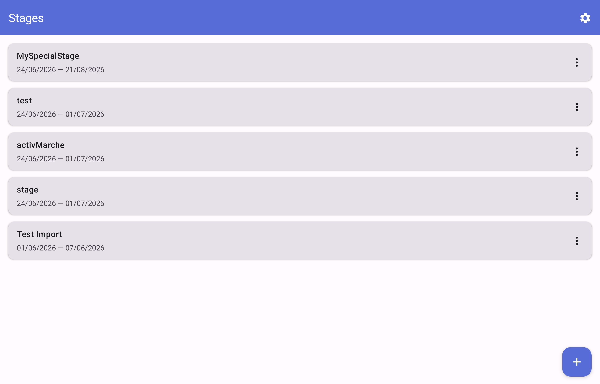
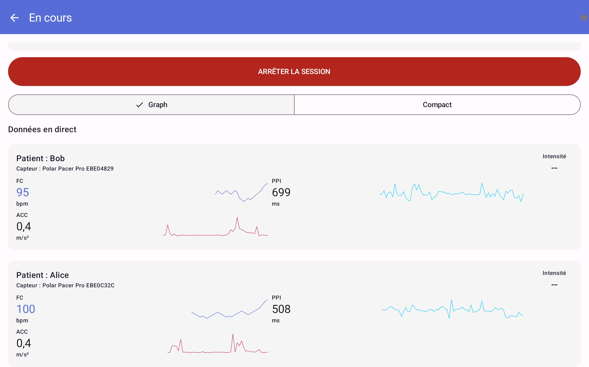
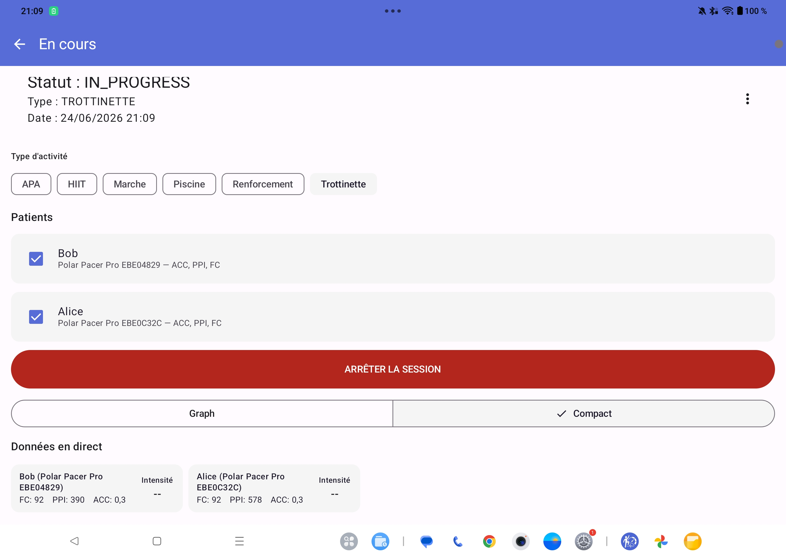
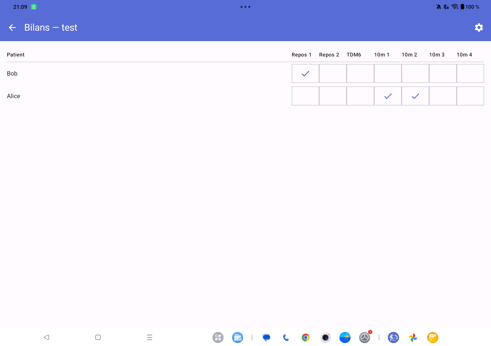
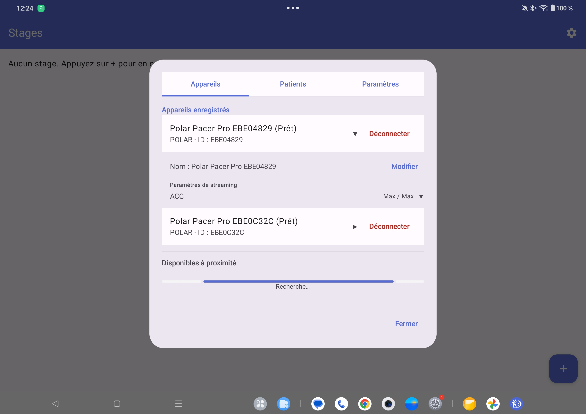
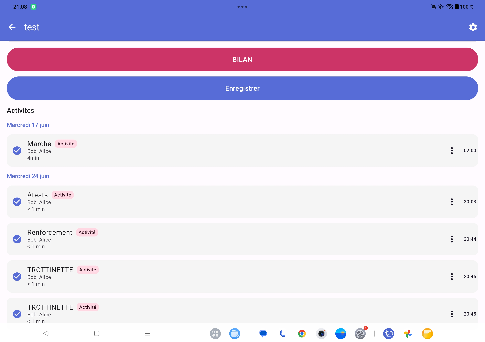

# VigoTrack


> Rehabilitation data collection via Polar and Xsens Dot BLE sensors.

VigoTrack is an Android application built with Kotlin and Jetpack Compose that connects to Polar BLE and Xsens Dot wearable sensors to stream, visualize, and log biometric data during physical therapy and rehabilitation sessions. It supports multiple patients, multiple sensors (simultaneous Polar + Xsens), and structured therapy stages with CSV export.

---

## Screenshots








---

## Features

- **Stage Management** — Organize rehabilitation into named periods with start/end dates
- **Activity Sessions** — Create data-collection sessions with types: MARCHE, APA, HIIT, RENFORCEMENT, PISCINE, TDM6, 10m walk test, REPOS
- **Bilan Grid** — Matrix view of patients vs. assessment types for quick recording
- **Multi-Vendor BLE** — Connect to Polar and Xsens Dot devices simultaneously via a pluggable `VendorApi` abstraction
- **Real-Time Streaming** — Live FC (heart rate), PPI, Accelerometer (X/Y/Z), ECG, Euler angles, Quaternion, and Free Acceleration with Canvas-based mini-graphs
- **Compact / Graph Toggle** — Switch between full sensor cards with mini-graphs and a compact data row view
- **Per-Feature Visibility & Logging** — Independently toggle which data features display on screen and which are written to CSV per sensor
- **Activity Invalidation** — Mark completed activities as invalid (`INVALIDÉ`) via a 3-dot menu, with `errorContainer` visual styling
- **Resume Completed Activities** — Reprise button to restart streaming on previously completed sessions
- **Accumulated Time** — Elapsed time persists across pauses, resumes, and app restarts
- **Editable Activity Name & Date** — Rename or reschedule an activity at any time via the dropdown menu on its card
- **Patient Management** — Add/delete patients, pre-link them to sensors with default feature selections
- **Data Export** — Log all streamed data to structured files using Android SAF with a customizable file naming template
- **Foreground Service** — Keeps BLE connections alive and data streaming in the background via `SensorService`
- **Dark/Light Theme** — Material 3 with dynamic color support (Android 12+) and brand palette
- **Config Import** — Bulk-import patients, stages, activities, and sensor links from a JSON file
- **Forget Device** — Remove a saved sensor from the database and clean up all associated state
- **Server Export** — Stream sensor data to an InfluxDB 2.x server in real-time via HTTP batching (line protocol) with configurable URL, auth token, and bucket
- **Health Monitoring** — Passive connection tracking on each batch send, plus a manual test button in settings; server health status dot on the recording screen

---

## User Guide

### Requirements

- Android 13+ (API 33)
- A compatible Polar BLE device (e.g., Polar Pacer Pro) or Xsens Dot wearable

### Installation

Build the APK with Android Studio and sideload, or distribute via your preferred method.

```bash
git clone https://github.com/your-username/vigotrack.git
```

Open in Android Studio, sync Gradle, and run on a connected device.

### Quick Start

1. **Add a Stage** — Tap `+` on the main screen to create a rehabilitation stage
2. **Create an Activity** — Tap a stage, then tap a date to create a new activity session
3. **Connect a Sensor** — Open settings (gear icon) → scan for nearby devices → connect
4. **Link a Patient** — In settings, assign a patient to the connected sensor
5. **Start Streaming** — In the activity session screen, toggle between **Graph** and **Compact** view, then tap a patient card to begin recording
6. **Export Data** — Choose an export folder in settings; CSV files are written automatically. Optionally configure a server URL, auth token, and InfluxDB bucket in settings to stream data live to a remote InfluxDB instance.

### Config Import

Bulk-import patients, stages, activities, and sensor links from a JSON file. Tap the **+** FAB on the main screen and select **Importer une config**, then pick a JSON file. A preview shows the counts of items to create. On confirmation, new records are created and a result dialog reports created, skipped, or errored items. Unknown activity type names are automatically added as custom types.

Full JSON schema and an example file are documented in [docs/config_import.md](docs/config_import.md).

### Stages

Stages represent phases of rehabilitation. Each stage has a name, start date, and end date. They are listed on the home screen as cards ordered by start date (newest first). Tap a stage to view its detail screen showing activities grouped by day. Use the three-dot menu on a stage card to **Modifier** (edit) or **Supprimer** (delete) a stage — deleting a stage also removes all its linked activities.

### Activity Sessions

Each activity belongs to one of two categories:

| Category | Types |
|---|---|
| **Activité** | MARCHE, APA, HIIT, RENFORCEMENT, PISCINE |
| **Bilan** | TDM6 (6-minute walk test), 10m (10-meter walk), REPOS |

Activities can be **Scheduled**, **In Progress**, **Completed**, or **Invalidated** (no effect on the recorded files, PLANNED). Completed activities can be resumed via the **REPRENDRE** button, which restarts streaming and continues accumulating elapsed time. You can change the activity type mid-session, which automatically splits the session.

### Bilan Grid

Navigate to the Bilan screen to see a matrix of patients vs. assessment types. Tap any cell to start or record that assessment. Completed assessments show a checkmark.

### Connecting Sensors

Open the settings dialog from any screen via the gear icon. The **Devices** tab shows two sections:

- **Nearby** — Currently discovered BLE devices from all active vendors (Polar, Xsens). Excludes sensors already saved in the database.
- **Appareils enregistrés** (Registered devices) — All previously paired sensors with per-row status:
  - *Connected / Prêt* → expandable row with feature toggles + **Déconnecter** button
  - *Disconnected* → static row with **Connecter** button

Each device shows a vendor badge (`POLAR` or `XSENS`). Once connected, the connection state transitions through:

`NOT_CONNECTED` → `CONNECTING` → `CONNECTED` → `FEATURES_READY`

Use the **Oublier** (Forget) button on any saved device to permanently remove it from the database and clear all associated state.

Use the **Patients** tab to pre-configure patient-sensor-feature associations. Sensors persist across app restarts with auto-reconnection.

### Live Data Visualization

During an active session, each linked patient displays color-coded cards showing live values for the streamed data types. Use the **Graph** / **Compact** toggle to switch between full cards (with mini line charts) and a dense data row view.

Available data types (each independently togglable for display and logging via the devices dialog):
- **FC** — Fréquence Cardiaque (beats per minute)
- **PPI** — Pulse-to-pulse interval in ms
- **ACC** — Accelerometer magnitude in m/s²
- **ECG** — Voltage in µV
- **EULER** — Roll / Pitch / Yaw angles (Xsens Dot)
- **FREE ACC** — Free acceleration X/Y/Z in m/s² (Xsens Dot)

### Data Export

Streamed data is logged to CSV files using the Android Storage Access Framework. Per-feature **log toggles** (in the devices dialog) control which data types produce CSV files — only enabled features are written. The default file naming template is:

```
{stage}/{patient}/{category}/{activity}_{datetime}/{sensor}_{tag}
```

Available placeholders:

| Placeholder | Description |
|---|---|
| `{stage}` | Stage name |
| `{patient}` | Patient name |
| `{category}` | Activity category |
| `{activity}` | Activity type |
| `{sensor}` | Sensor display name |
| `{device}` | Device address |
| `{tag}` | Data type (HR, PPI, ACC, ECG, EULER, QUATERNION, FREE_ACCELERATION) |
| `{date}` | Current date (yyyyMMdd) |
| `{time}` | Current time (HHmmss) |
| `{datetime}` | Date + time |
| `{timestamp}` | Unix epoch ms |

Each data type produces a separate CSV file with appropriate headers.

---

## Developer Guide

### Tech Stack

| Layer | Technology |
|---|---|
| **Language** | Kotlin 2.3.21 |
| **UI** | Jetpack Compose + Material 3 (BOM 2025.02.00) |
| **Navigation** | Navigation Compose 2.9.8 |
| **Architecture** | MVVM (ViewModel + StateFlow + Repository) |
| **Database** | Room 2.8.4 (KSP) |
| **BLE SDK (Polar)** | Polar BLE SDK 7.1.0 (JitPack) |
| **BLE SDK (Xsens)** | Xsens Dot SDK 2.x (proprietary `.aar` — not in build by default) |
| **Vendor Abstraction** | Custom `VendorApi` interface |
| **Reactive** | RxJava 3, RxAndroid 3, coroutines-rx3 bridge |
| **DI** | Manual (via Application class) |
| **Build** | Gradle KTS, AGP 8.9.1, JDK 17 |

### Setup

```bash
git clone https://github.com/your-username/vigotrack.git
```

Open the project in **Android Studio Ladybug** (or newer). The Gradle sync should download all dependencies automatically. If you encounter SDK issues, ensure `local.properties` points to your Android SDK:

```
sdk.dir=/path/to/Android/Sdk
```

Run on a device or emulator (API 33+). BLE features require a physical device with a Polar sensor.

### Project Structure

```
app/src/main/java/com/maathisv/vigotrack/
├── VigoTrackApplication.kt        # Application class (manual DI)
├── MainActivity.kt                 # Entry point, permissions, NavHost
├── models/                         # Domain models (Patient, Stage, Sensor, etc.)
├── data/
│   ├── VigoTrackDatabase.kt        # Room database (v7)
│   ├── dao/                        # Room DAOs (5 tables)
│   ├── entities/                   # Room entities (6 tables)
│   └── mappers/                    # Entity ↔ Domain mappers
├── sensor/
│   ├── api/                        # VendorApi interface + sealed data types (SensorDataPoint, SensorEvent, SensorDataType)
│   ├── polar/                      # PolarVendorApi + PolarMappers (wraps PolarBleApi)
│   └── xsens/                      # XsensVendorApi placeholder + XsensMappers (requires AAR)
├── repository/
│   ├── SensorRepository.kt         # Vendor-agnostic BLE management via VendorApiRegistry
│   ├── ActivityRepository.kt       # Activity CRUD
│   └── VendorApiRegistry.kt        # Routes SDK calls to the correct VendorApi by vendor name
├── services/
│   └── SensorService.kt            # Foreground LifecycleService (logs from unified sensorDataFlow)
├── ui/
│   ├── navigation/                 # NavGraph + route definitions
│   ├── screens/                    # Screen composables + ViewModel
│   ├── components/                 # Reusable composables
│   └── theme/                      # Color, Theme, Typography
└── util/
    └── DataLogger.kt               # CSV file logger (SAF)
```

### Architecture

The app follows an MVVM pattern with manual dependency injection:

```
UI (Compose) → HomeViewModel → Repository → Room Database / Polar SDK
```

`HomeViewModel` is a shared `AndroidViewModel` injected via the Navigation Graph. It exposes state via `StateFlow`/`SharedFlow`. Repositories are initialized lazily in `VigoTrackApplication` and passed through.

The `SensorRepository` manages BLE scanning, connection lifecycle, auto-reconnection, and data streaming via a `VendorApiRegistry`. Each vendor (Polar, Xsens) implements the `VendorApi` interface and is registered in `VigoTrackApplication`. The repository exposes a unified `sensorDataFlow: SharedFlow<Pair<String, SensorDataPoint>>` for all data types from all vendors, and a `liveData: StateFlow<Map<String, Map<String, Any>>>` for the UI.

### Database Schema

| Table | Key Columns | Description |
|---|---|---|
| `stages` | id, name, startDate, endDate | Rehabilitation phases |
| `activities` | id (String UUID), activityType, scheduledDate, startTime, endTime, isRunning, accumulatedTimeMs, isStale, stageId (FK) | Data-collection sessions |
| `activity_links` | linkId, parentActivityId (FK), patientId (FK), patientName, sensorId (FK), features | Links activities to patients/sensors |
| `patients` | id, name, isCalibrated, createdAt | Patient records |
| `sensors` | deviceId (PK), address, name, displayName, lastSeen, vendor | Paired devices from any vendor |
| `sensor_patient_links` | id, patientId (FK), sensorId (FK), features | Pre-configured patient-sensor associations |

### Key Dependencies

All versions are managed via `gradle/libs.versions.toml`. Major dependencies:

- `com.github.polarofficial:polar-ble-sdk:7.1.0` — Polar BLE communication (Maven, auto-downloaded)
- **Xsens Dot AARs — NOT in the Gradle build by default.** The `app/libs/` directory doesn't exist. The app compiles and runs without it (XsensVendorApi returns empty flows — no crash, no error). To activate:
  1. Obtain `XsensDotSdkCore2.aar` + `XsensDotCore.aar` from Movella
  2. Create `app/libs/` and copy the AARs there
  3. Add to `app/build.gradle.kts` dependencies:
     ```kotlin
     implementation(fileTree(mapOf("dir" to "libs", "include" to listOf("*.aar"))))
     ```
- `androidx.room:room-*:2.8.4` — Local persistence
- `androidx.compose:compose-bom:2025.02.00` — Compose UI toolkit
- `io.reactivex.rxjava3:rxjava:3.1.12` — Reactive streams
- `androidx.navigation:navigation-compose:2.9.8` — Screen navigation
- `com.squareup.okhttp3:okhttp:5.4.0` — HTTP client for InfluxDB server export
- `com.google.mlkit:play-services-code-scanner:16.1.0` — QR code scanning for server auth token

> **Note:** Only Polar BLE integration has been tested end-to-end. Xsens Dot vendor support and the multi-vendor `VendorApi` framework are implemented as a compatible abstraction but remain untested with real hardware.

### Adding a New Vendor

0. **Add SDK dependency** to `app/build.gradle.kts` (Maven coordinate or local AAR via `fileTree`)
1. **Implement `VendorApi`** in `sensor/<vendor>/` with the interface methods (`startScanning()`, `connectToDevice()`, `startStreaming()`, etc.)
2. **Create mapper functions** to convert the vendor's SDK types to `SensorDataPoint` sealed subtypes
3. **Register** the new `VendorApi` instance in `VigoTrackApplication.vendorRegistry`:
   ```kotlin
   private val vendorRegistry by lazy {
       VendorApiRegistry(listOf(polarVendorApi, xsensVendorApi, myNewVendorApi))
   }
   ```
4. All SDK routing happens automatically via the `vendorName` string stored in `Sensor.vendor`.

> **Note:** Only Polar has been tested with physical devices. If you integrate or verify a new vendor implementation, please update this note accordingly.

### Testing

Currently the project includes default template tests (no custom tests) :
- `app/src/test/` — Unit tests (JUnit 4)
- `app/src/androidTest/` — Instrumented tests (Compose UI Test)

---

## Acknowledgments

- **Fondation Ellen Poidatz** — Visual identity / brand color palette
- **Polar** — BLE SDK and wearable hardware

---

## License

<!-- TODO: Choose a license -->
TBD
